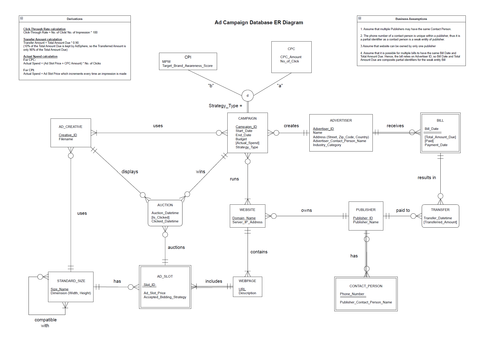

# Advertisement Campaign Database System | _MySQL_

## Description
Designed and implemented a relaitonal database system to manage advertisers, campaigns, publishers, and billing operations.

## Features
- structured relational schema with primary and foreign keys
- data imported using 'Load Data Infile'
- business oriented queries (eg. unpaid bills, advertiser-campaign relationships)
- queries using JOIN, aggregation, and filtering

## ER Diagram

- The diagram illustrates the relationships between advertisers, campaigns, publishers, and billing entities
- Advertisers launch campaigns and pays bill to publish campaign on Publisher's website

## Files
- `Schema.sql` --> table creation
- `InsertData.sql` --> Data import & insert
- `Queries.sql` --> analysis queries

## How to Run
1. Create the database in MySQL.
2. Run `Schema.sql` to build tables.
3. Use `InsertData.sql` to populate with sample records.
4. Run queries from `Queries.sql` for analysis.

## Key Learning Points
- Schema design
- Writing efficient SQL queries
- Simulating real-world relational structures using synthetic data

